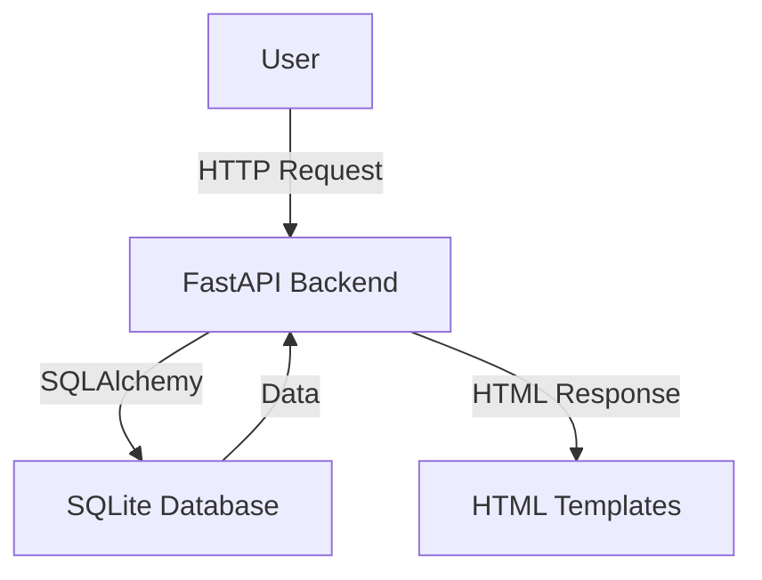

# Decentralized Finance Dashboard for Crypto Traders

## Overview
The Decentralized Finance Dashboard for Crypto Traders is a comprehensive web application designed to provide cryptocurrency traders with a robust platform to manage their portfolios, track transaction history, and set up market alerts. This project aims to simplify the complexities of crypto trading by offering a user-friendly interface to monitor and analyze assets in real-time. Traders can benefit from the dashboard's ability to provide insights into their portfolio performance, historical transactions, and market conditions, all in one place. The application leverages FastAPI for backend services and a SQLite database for data management, ensuring a seamless and efficient user experience.

## Features
- **User Management**: Securely manage user profiles with unique usernames and emails.
- **Portfolio Tracking**: Monitor and analyze cryptocurrency holdings and performance.
- **Transaction History**: View detailed records of past transactions, including type and amount.
- **Market Alerts**: Set up alerts for specific market conditions to stay informed.
- **Responsive Design**: Access the dashboard on various devices with a responsive interface.

## Tech Stack
| Technology  | Description                      |
|-------------|----------------------------------|
| Python      | Programming language             |
| FastAPI     | Web framework for the backend    |
| Uvicorn     | ASGI server for FastAPI          |
| SQLAlchemy  | ORM for database interactions    |
| SQLite      | Lightweight database             |
| Docker      | Containerization platform        |
| Bootstrap   | CSS framework for styling        |

## Architecture
The project is structured with a FastAPI backend serving HTML templates for the frontend. The backend communicates with a SQLite database using SQLAlchemy ORM to manage data models and transactions. The application includes several API endpoints for different functionalities, such as retrieving user portfolios and transaction histories.



## Getting Started

### Prerequisites
- Python 3.11+
- pip (Python package manager)
- Docker (optional for containerized deployment)

### Installation
1. Clone the repository:
   ```bash
   git clone https://github.com/yourusername/decentralized-finance-dashboard-for-crypto-traders-auto.git
   cd decentralized-finance-dashboard-for-crypto-traders-auto
   ```
2. Install the required Python packages:
   ```bash
   pip install -r requirements.txt
   ```

### Running the Application
1. Seed the database with initial data:
   ```bash
   python app.py
   ```
2. Start the FastAPI server:
   ```bash
   uvicorn app:app --reload
   ```
3. Open your browser and visit:
   ```
   http://localhost:8000
   ```

## API Endpoints
| Method | Path           | Description                            |
|--------|----------------|----------------------------------------|
| GET    | /              | Returns the home page                   |
| GET    | /portfolio     | Displays the user's portfolio           |
| GET    | /transactions  | Shows the transaction history           |
| GET    | /alerts        | Manages market alerts                   |
| GET    | /profile       | Displays the user profile page          |

## Project Structure
```
.
├── Dockerfile                # Docker configuration file
├── app.py                    # Main application file
├── requirements.txt          # Python dependencies
├── start.sh                  # Script to start the application
├── static
│   └── css
│       └── bootstrap.min.css # Bootstrap CSS for styling
├── templates
│   ├── alerts.html           # Alerts page template
│   ├── index.html            # Home page template
│   ├── portfolio.html        # Portfolio page template
│   ├── profile.html          # Profile page template
│   └── transactions.html     # Transactions page template
```

## Screenshots


## Docker Deployment
1. Build the Docker image:
   ```bash
   docker build -t crypto-dashboard .
   ```
2. Run the Docker container:
   ```bash
   docker run -p 8000:8000 crypto-dashboard
   ```

## Contributing
Contributions are welcome! Please fork the repository and submit a pull request for review. Ensure that your code adheres to the project's coding standards and includes relevant tests.

## License
This project is licensed under the MIT License.

---
Built with Python and FastAPI.